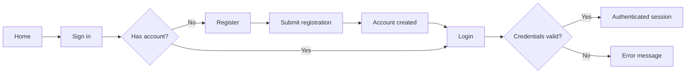
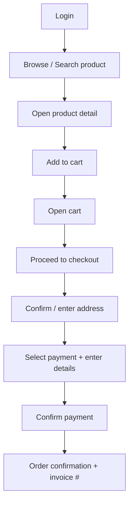
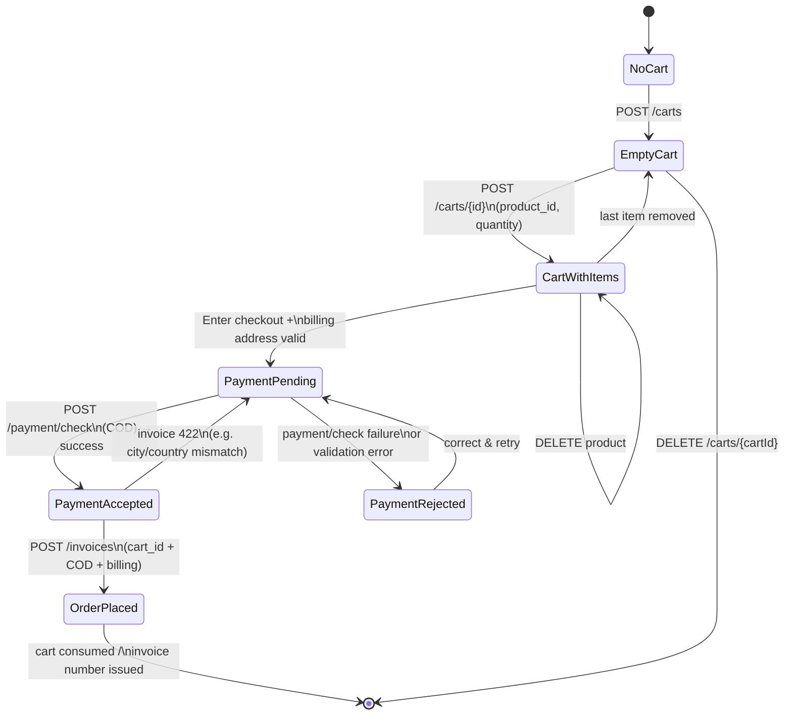
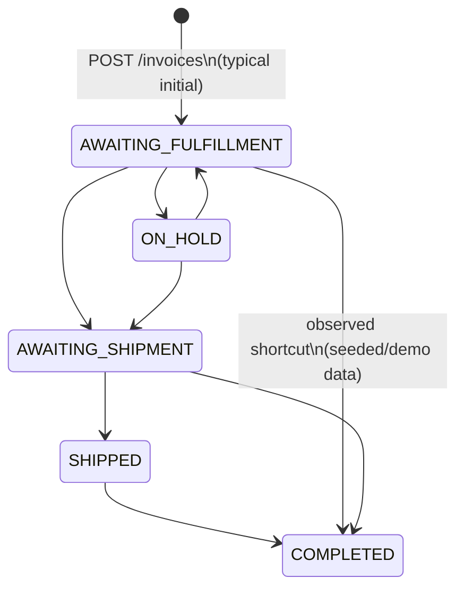
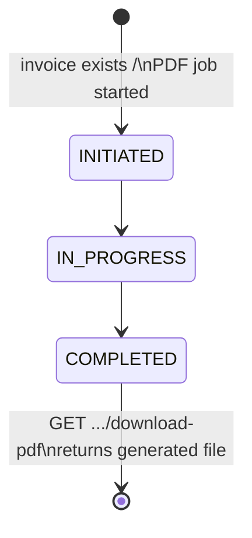

# QA Analysis — Practice Software Testing (Toolshop)

**Application:** [https://practicesoftwaretesting.com/](https://practicesoftwaretesting.com/)  
**Type:** E-commerce Toolshop (Sprint 5) for practice testing  
**Scope:** AC1 — User Registration & Login | AC2 — End-to-End Purchase Flow  
**Stack (reference):** Angular FE · Laravel API · MariaDB  

---

## 1. Functional Modules

| Module | AC | Key capabilities |
|--------|----|------------------|
| **Registration** | AC1 | New customer account creation (name, email, password, address/contact fields); field validation; duplicate-email handling |
| **Authentication / Login** | AC1 | Sign-in with email/password; session/token establishment; logout; invalid-credential handling |
| **Account / Session** | AC1, AC2 | Authenticated user context; session persistence; post-login greeting/identity |
| **Product Catalog** | AC2 | Home listing, categories/brands, product detail (name, price, stock, image) |
| **Search & Filter** | AC2 | Keyword search; category/brand filters (supporting discovery before purchase) |
| **Shopping Cart** | AC2 | Add/update/remove items; quantity; price/subtotal; cart icon badge |
| **Checkout** | AC2 | Cart review → shipping/billing address → payment method → confirm |
| **Payment** | AC2 | Simulated payment (e.g. credit card); success/failure messaging |
| **Order Confirmation** | AC2 | Success message; invoice/order number |

---

## 2. User Journeys

### AC1 — User Registration & Login



| Journey | Steps (high level) | Expected outcome |
|---------|-------------------|------------------|
| **J1 — Happy path register** | Open Register → fill valid unique data → submit | Account created; user can log in |
| **J2 — Happy path login** | Sign in → valid email/password → submit | Session established; user identity shown |
| **J3 — Register then login** | Register → navigate to Login → authenticate | Full AC1 chain verified |
| **J4 — Negative login** | Invalid password / empty fields / bad email format | Clear validation or auth error; no session |
| **J5 — Negative register** | Duplicate email / missing required fields / weak password (if rules exist) | Blocked with field/API errors |

**Primary test personas (seeded):**  
`customer@practicesoftwaretesting.com` / `welcome01` · `customer2@...` / `welcome01`

---

### AC2 — End-to-End Purchase Flow



| Journey | Steps (high level) | Expected outcome |
|---------|-------------------|------------------|
| **J6 — Happy path purchase** | Login → search/select product → add to cart → checkout → address → pay → confirm | Payment success + order/invoice confirmation |
| **J7 — Multi-item purchase** | Add multiple products/qty → checkout | Correct line items and totals |
| **J8 — Cart adjust then buy** | Change qty / remove item → proceed | Totals update; order matches cart |
| **J9 — Out-of-stock / invalid cart** | Attempt add when unavailable or invalid product | Action blocked or clear error |
| **J10 — Checkout validation** | Empty/invalid address or payment fields | Field errors; order not placed |

**Canonical happy-path example (known on this site):** Login → search “Thor Hammer” → add to cart → proceed → address → credit card → confirm → invoice message.

---

## 3. Risks

| Area | Risk | Impact | Likelihood | Notes |
|------|------|--------|------------|-------|
| **Auth security** | Weak validation / injection in login-register fields | High | Medium | Credential exposure, XSS/SQLi practice surface |
| **Auth UX** | Over-specific error messages (“wrong password” vs “email not found”) | Medium | Medium | Aids enumeration |
| **Session** | Session not created, not cleared on logout, or lost mid-checkout | High | Medium | Breaks AC1→AC2 handoff |
| **Registration data** | Duplicate emails accepted / unique constraint fails | High | Medium | Corrupt identity for purchase |
| **Catalog accuracy** | Wrong price, stock, or product ID | High | Medium | Wrong order totals / failed cart API |
| **Cart integrity** | Qty/stock mismatch; cart clears unexpectedly; badge out of sync | High | High | Known flaky behavior reported on this app historically |
| **Checkout totals** | Subtotal/tax/shipping miscalculation | High | Medium | Revenue/trust failure |
| **Payment** | False success/failure; double submit | High | Medium | Fake gateway still needs deterministic outcomes |
| **Order confirmation** | Payment OK but no invoice / silent failure | High | Low–Med | Incomplete AC2 |
| **Environment** | Cloudflare bot challenge / rate limits | Medium | Medium | Blocks automation/manual runs |
| **Shared test data** | Seeded accounts mutated by other testers | Medium | High | Flaky E2E on public hosted env |
| **Inventory** | Concurrent purchases oversell stock | Medium | Medium | Race on public demo |

---

## 4. Dependencies

| Dependency | Needed for | Type |
|------------|------------|------|
| **UI** `practicesoftwaretesting.com` (Sprint 5) | All UI flows | External hosted app |
| **API** `api.practicesoftwaretesting.com` | Auth, products, carts, orders | Backend |
| **Auth/session mechanism** (token/cookie) | Login → protected checkout | Platform |
| **Product catalog data** | Search, PDP, pricing | Data |
| **Cart service** | Add-to-cart / checkout entry | Service |
| **Payment simulation** | Final purchase step | Simulated gateway |
| **Browsers + JS/cookies** | SPA (Angular) | Client |
| **Network / HTTPS / Cloudflare** | Reachability | Infra |
| **Test accounts or unique registration data** | Repeatable AC1/AC2 | Test data |
| **Stable product fixture** (e.g. Thor Hammer @ $11.00) | Deterministic price asserts | Data |

---

## 5. Assumptions

1. Scope is the **customer (user) role** on Sprint 5 production host, not admin or “with-bugs” variant unless specified.
2. **Registration creates a customer** who can immediately log in and purchase.
3. **Login is required** (or strongly expected) before completing checkout; guest checkout is not assumed.
4. Payment uses **simulated/test card data**; no real money or real PSP settlement.
5. Field rules (password strength, address formats, phone) match **current UI/API validation** on the live site.
6. Seeded accounts remain usable (`welcome01` / `pass123`) unless registration-only tests use unique emails.
7. Success criteria for AC2 include **visible confirmation** (e.g. payment success + invoice/order number).
8. Currency and prices displayed in UI match API responses for assertions.
9. Cart may support anonymous add, but E2E purchase under AC2 is validated as an **authenticated** journey.
10. Non-functional targets (perf SLAs, a11y WCAG levels) are **not** part of these two ACs unless added later.

---

## 6. Out of Scope

Explicitly **not** covered by AC1 + AC2 unless separately requested:

| Out of scope | Reason |
|--------------|--------|
| Admin portal / role-based admin features | Different persona |
| Contact form, favorites, reviews, profile edit (beyond auth) | Not in ACs |
| Password reset / email verification / MFA | Not stated in AC1 |
| Category filter-only testing as primary objective | Supporting discovery only |
| Mobile native apps (v4 integration) | Different client |
| Sprint 1–4 or `with-bugs` environments | Different baselines |
| Real payment gateway / PCI compliance audits | Simulated shop |
| Performance, load, chaos, full security pen-test | Separate workstreams |
| Localization / multi-currency | Not indicated as AC |
| Backend-only contract testing (except as support) | ACs are user-facing journeys |
| CI/CD, infra, and deployment pipelines | Delivery concern, not AC |

---

## Traceability Summary

| AC | Must prove | Critical path modules |
|----|------------|------------------------|
| **AC1** | New user can register; existing/new user can log in securely with clear errors on failure | Registration, Login, Session |
| **AC2** | Logged-in user can discover a product, cart it, checkout, pay, and receive order confirmation | Catalog/Search, Cart, Checkout, Payment, Order Confirmation |

**Recommended test priority:** J1 → J2 → J3 (AC1) then J6 (AC2 happy path) before negatives (J4–J5, J9–J10) and multi-item/cart edge cases (J7–J8).

---

## 7. Deep-Dive Assessment (API-Aligned) — AC1 Profile Verification & AC2 COD Checkout

**Sources:** UI [practicesoftwaretesting.com](https://practicesoftwaretesting.com/) · API docs [api.practicesoftwaretesting.com/api/documentation](https://api.practicesoftwaretesting.com/api/documentation) (Toolshop API v5.0.0) · Live API status `Toolshop` / environment `production`

**Refined AC scope for this assessment:**

| AC | Journey under test |
|----|--------------------|
| **AC1** | User Registration & Login → **Profile Verification** |
| **AC2** | Product Browse & Search → Add/Update Cart → **Cash on Delivery** Checkout → **Double Confirmation** → **Invoice Generation** |

---

### 7.1 Core Functional Modules (Assessment Scope)

| Module | UI surfaces (observed) | Primary API surface | Role in AC1/AC2 |
|--------|------------------------|---------------------|-----------------|
| **User Registration** | `/auth/register` | `POST /users/register` | AC1 — create customer |
| **Authentication** | `/auth/login` | `POST /users/login`, `GET /users/logout`, `GET /users/refresh` | AC1 — JWT session |
| **Profile / Identity** | `/account`, `/account/profile` | `GET /users/me` (+ optional `PUT/PATCH /users/{userId}`) | AC1 — profile verification |
| **Product Catalog** | `/` (listing), product detail | `GET /products`, `GET /products/{productId}` | AC2 — browse |
| **Search & Discovery** | Home search / filters | `GET /products/search?q=`, filters on `GET /products` (`by_brand`, `by_category`, `between`, `sort`, `is_rental`) | AC2 — search |
| **Cart** | `/cart` | `POST /carts`, `POST /carts/{id}`, `PUT .../product/quantity`, `DELETE .../product/{productId}`, `GET /carts/{cartId}` | AC2 — add/update cart |
| **Checkout (Billing)** | `/checkout` | Invoice payload fields + optional `GET /postcode-lookup` | AC2 — address capture |
| **Payment (COD)** | Checkout payment step | `POST /payment/check` with `payment_method=cash-on-delivery` | AC2 — confirmation #1 |
| **Order / Invoice** | Checkout success, `/account/invoices` | `POST /invoices` (auth), `GET /invoices`, `GET /invoices/{invoiceId}` | AC2 — confirmation #2 + persistence |
| **Invoice PDF Generation** | Invoice download UX | `GET /invoices/{invoice_number}/download-pdf-status`, `.../download-pdf` | AC2 — invoice generation |

**Supporting modules present in API but not primary for AC1/AC2:** Brand, Category (admin CRUD), Contact/Messages, Favorites, Images, Product Specs, Reports, TOTP, Admin user management, Guest invoice (`POST /invoices/guest`), non-COD payment methods.

---

### 7.2 Primary State Machines — Checkout & Invoices

#### 7.2.1 Checkout / Cart → COD Payment → Order (customer journey)

There is **no separate `/checkouts` resource**. Checkout is a composed flow over **Cart → Payment check → Invoice create**.



| State | Meaning | Exit criteria |
|-------|---------|---------------|
| **NoCart / EmptyCart** | Cart id may exist with zero lines | Add in-stock product |
| **CartWithItems** | Mutable line items & quantities | Proceed to checkout with qty > 0 |
| **PaymentPending** | Billing + COD selected; order not yet created | `POST /payment/check` |
| **PaymentAccepted** | Simulated COD validation OK (`Payment was successful`) | `POST /invoices` with same `cart_id` |
| **OrderPlaced** | Invoice entity created for authenticated user | Invoice number + initial order status present |

**Double confirmation (AC2 interpretation):**

1. **Payment confirmation** — UI/API success from `POST /payment/check` for `cash-on-delivery` (empty `payment_details` object is valid).
2. **Order confirmation** — successful `POST /invoices` returning `invoice_number` / confirmation UI, then invoice visible under account invoices.

Both must succeed; payment success alone is **not** sufficient for AC2 pass.

#### 7.2.2 Invoice / Order fulfillment status machine

Invoice `status` (order lifecycle) — API enum on `PUT /invoices/{invoiceId}/status`:



| Status | Typical meaning for tests |
|--------|---------------------------|
| `AWAITING_FULFILLMENT` | Order accepted; fulfillment not started |
| `ON_HOLD` | Blocked / needs attention (`status_message` 5–50 chars when set) |
| `AWAITING_SHIPMENT` | Ready to ship |
| `SHIPPED` | In transit (observed on live customer invoices) |
| `COMPLETED` | Terminal success (common on seeded/demo invoices) |

**Assessment note:** Customer AC2 asserts **creation** and visibility of the invoice. Transitions after place-order are primarily **admin** (`PUT /invoices/{id}/status`) and are out of customer happy-path unless explicitly added.

#### 7.2.3 Invoice PDF generation state machine

Independent of order `status`. Documented on `GET /invoices/{invoice_number}/download-pdf-status`:



| PDF status | Test implication |
|------------|------------------|
| `INITIATED` | Job accepted; download may not be ready |
| `IN_PROGRESS` | Poll / wait before asserting file |
| `COMPLETED` | Safe to download/assert PDF |

---

### 7.3 AC Journey Mapping (API-backed)

#### AC1 — Registration & Login → Profile Verification

```text
POST /users/register  →  POST /users/login  →  GET /users/me
         │                      │                    │
   UserRequest             access_token         profile fields
   (password rules,        (Bearer JWT)         match registration
    DOB 18–75, unique                           / expected identity
    email, address…)
```

**Profile verification checks:** `first_name`, `last_name`, `email`, address object, `phone`, `dob`, `id`, `enabled`/`totp_enabled` as applicable; UI account/profile must reflect the same identity after login.

#### AC2 — Browse/Search → Cart → COD → Double Confirm → Invoice

```text
GET /products[/search]
        → POST /carts → POST /carts/{id} → PUT .../quantity
        → POST /payment/check { cash-on-delivery }
        → POST /invoices { cart_id, billing_*, payment_method, payment_details }
        → GET /invoices/{id}  and/or  PDF status → download-pdf
```

**COD specifics:** `payment_method` enum includes `cash-on-delivery`; `CashOnDeliveryDetails` is an empty object placeholder (no card/bank fields).

---

### 7.4 Dependencies & Key Assumptions

#### Dependencies

| Dependency | Why it matters |
|------------|----------------|
| Sprint 5 UI + API (`practicesoftwaretesting.com` / `api.practicesoftwaretesting.com`) | SUT baseline for this assessment |
| JWT Bearer auth (`apiAuth`) after login | Required for `GET /users/me`, `POST /invoices`, invoice list/PDF |
| Cart id continuity across checkout | Invoice requires valid `cart_id` with line items |
| In-stock catalog product | `in_stock=true` product required for add-to-cart success path |
| Billing address validation (city ↔ country) | `POST /invoices` returns 422 when city does not belong to selected country; may use `GET /postcode-lookup` |
| Payment check service | First confirmation gate before invoice create |
| Async PDF worker / status endpoint | Invoice “generation” may lag create; poll `download-pdf-status` |
| Browser JS + cookies; Cloudflare edge | SPA + bot challenges can block UI automation |
| Unique registration email / stable seeded customer | Shared public env mutates data |

#### Key assumptions

1. Assessment targets **customer** flows on **Sprint 5 production**, not admin, mobile app, or `with-bugs`.
2. AC1 profile verification uses **`GET /users/me` / Account Profile** immediately after register→login (or login of newly registered user).
3. AC2 checkout under test is **authenticated COD only** (not guest `POST /invoices/guest`, not credit-card/BNPL/gift-card/bank-transfer as primary path).
4. **Double confirmation** = payment-check success **and** invoice/order confirmation (not two identical UI modals only).
5. Cart may be created **without** auth; placing the order via `POST /invoices` **requires** auth for AC2.
6. Password policy matches API: min 8 chars with uppercase, lowercase, number, and symbol; DOB between 18 and 75 years.
7. COD `payment_details` may be `{}`; payment check is simulated and does not move real money.
8. Invoice PDF readiness is **eventually consistent**; tests may need short polling.
9. Seeded demo accounts may already have invoices in `SHIPPED`/`COMPLETED`; new purchases should assert on the **newly created** invoice number.
10. UI route labels map to the API composition above even though checkout is not a single REST resource.

---

### 7.5 Explicit Out-of-Scope Boundaries (This Assessment)

| Out of scope | Boundary rationale |
|--------------|--------------------|
| Admin PIM, brand/category CRUD, reporting dashboards | Not in AC1/AC2 customer journeys |
| Non-COD payment methods (credit-card, bank-transfer, BNPL, gift-card) as primary path | AC2 specifies Cash on Delivery |
| Guest checkout (`POST /invoices/guest`) | AC2 assumes registered/logged-in purchase |
| TOTP / MFA setup & verify | Not part of AC1 profile verification |
| Password forgot/change flows | Adjacent auth; not stated in AC1 |
| Contact messages, favorites, product specs | Separate modules |
| Invoice status progression by admin after place-order | Fulfillment ops; AC2 ends at invoice generation/visibility |
| Negative/chaos testing of Cloudflare, rate limits, full pen-test | Environment/security workstreams |
| Sprint 1–4 hosts, `with-bugs`, holtesting variants | Different baselines |
| Native mobile clients | Different client; API shared only with v4 per upstream docs |
| Performance/load SLAs, a11y certification, i18n/L10n | Not in stated ACs |
| Real PSP/PCI, email delivery (MailCatcher local-only) | Not available/relevant on public COD path |
| Destructive cleanup of shared public data beyond test-owned records | Shared multi-tenant demo risk |

---

### 7.6 Assessment Exit Criteria (Concise)

| AC | Pass when |
|----|-----------|
| **AC1** | Unique user registers → logs in → profile (`/users/me` / Account Profile) shows correct identity; negatives blocked without session |
| **AC2** | Authenticated user finds product → cart add/update → COD payment check succeeds → invoice created with number → invoice (and PDF when completed) available |

**Suggested automation priority:** AC1 J1–J3 + profile assert → AC2 COD happy path (double confirm + invoice) → cart update variant → address/payment negatives.

---

## 8. Requirement Traceability Matrix (Core — AC1 / AC2)

**Application:** Toolshop (Sprint 5) — [practicesoftwaretesting.com](https://practicesoftwaretesting.com/)  
**Legend:** `@Smoke` = release gate · `@Regression` = broader suite · Priority `P0` = must-pass · Risk = impact if requirement fails  

| Req ID | Acceptance Criteria | Feature Area | Test Type (UI/API) | Scope | Priority | Risk Impact |
|--------|---------------------|--------------|--------------------|-------|----------|-------------|
| REQ-01 | **AC1** — User Registration & Login → Profile Verification | User Registration (happy path) | UI + API | `@Smoke` `@Regression` | P0 | **High** — blocks new customers and all downstream authenticated journeys |
| REQ-02 | **AC1** — User Registration & Login → Profile Verification | Login & session establishment | UI + API | `@Smoke` `@Regression` | P0 | **High** — no session ⇒ no profile verify and no authenticated checkout |
| REQ-03 | **AC1** — User Registration & Login → Profile Verification | Profile verification (`/account` / `GET /users/me`) | UI + API | `@Smoke` `@Regression` | P0 | **High** — wrong identity breaks trust and order attribution |
| REQ-04 | **AC1** — User Registration & Login → Profile Verification | Login negative (invalid / empty credentials) | UI + API | `@Regression` | P1 | **Medium** — auth bypass or weak errors enable account risk |
| REQ-05 | **AC2** — Browse & Search → Cart → COD → Double Confirm → Invoice | Product browse & search | UI + API | `@Smoke` `@Regression` | P0 | **High** — discovery failure blocks the entire purchase path |
| REQ-06 | **AC2** — Browse & Search → Cart → COD → Double Confirm → Invoice | Add / update cart | UI + API | `@Smoke` `@Regression` | P0 | **High** — wrong qty/lines ⇒ incorrect invoice totals |
| REQ-07 | **AC2** — Browse & Search → Cart → COD → Double Confirm → Invoice | COD checkout double confirmation (`/payment/check` + place order) | UI + API | `@Smoke` `@Regression` | P0 | **Critical** — false pay success or missing order confirmation = revenue/trust failure |
| REQ-08 | **AC2** — Browse & Search → Cart → COD → Double Confirm → Invoice | Invoice generation & visibility (number + PDF when `COMPLETED`) | UI + API | `@Smoke` `@Regression` | P0 | **Critical** — payment OK without invoice = incomplete AC2 / dispute risk |

### RTM coverage notes

| Slice | Req IDs | Intent |
|-------|---------|--------|
| AC1 critical path | REQ-01 → REQ-03 | Register → Login → Profile match |
| AC1 negative gate | REQ-04 | No session on bad credentials |
| AC2 critical path | REQ-05 → REQ-08 | Search → Cart → COD double confirm → Invoice |

**Out of this RTM (by design):** admin flows, non-COD payments, guest checkout, TOTP, favorites/contact, post-order fulfillment status changes.

---

## Conversation Summary

**Prompt:** Act as a Senior QA Lead. Analyze the system under test at https://practicesoftwaretesting.com/ and its API documentation… Identify core modules, checkout/invoice state machines, dependencies, assumptions, and out-of-scope. Format for appending to `ai-prompts/requirements-and-planning.md`.

**AI Response Summary:** Produced an API-aligned QA deep-dive for AC1 (register → login → profile) and AC2 (browse/search → cart → COD → double confirmation → invoice), including composed checkout state machines and PDF status flow. Restored prior planning content and appended §7 into `AI-Prompt/ai-prompts/requirements-and-planning.md` (mirrored under root `ai-prompts/`).

**Validation Notes:** OpenAPI pulled from `api.practicesoftwaretesting.com/docs?api-docs.json`; live checks confirmed login, cart, COD `/payment/check`, and invoice statuses. Invoice-create mutations with varied addresses were partially blocked/failed on city↔country validation; double confirmation defined as payment-check success + invoice create. UI was Cloudflare-limited; analysis leaned on API + known routes.

---

**Prompt:** Build a Markdown Requirement Traceability Matrix for Toolshop covering AC1 and AC2… Limit to 8 focused, high-impact core requirements.

**AI Response Summary:** Delivered an 8-row RTM (REQ-01–REQ-08) with columns for Req ID, AC, Feature Area, UI/API, `@Smoke`/`@Regression`, Priority, and Risk Impact. Appended as §8 in `requirements-and-planning.md`.

**Validation Notes:** Mapped RTM to refined ACs from §7 (profile verification, COD, double confirm, invoice/PDF). Kept only core path items; excluded admin, guest checkout, non-COD payments. REQ-04 is `@Regression` only; REQ-07/08 marked Critical risk.
